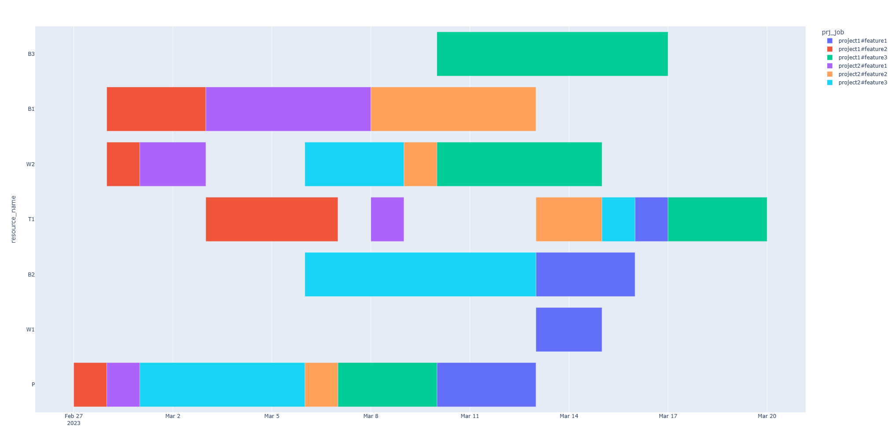

# FastProjectScheduler
Enter the duration and available resources of each project work, and the program automatically generates the shortest schedule plan.

## Introduction

The input of the program includes two parts infomation.

The first is the task list with the estimated task duration, as below.

The second is the available resources for each task, as below.

The output of the program includes a schedule table, and a gantt chart.

## How it works

The problem of making the shortest work schedule for a project team is a flexible job shop problem , because it involves assigning and ordering a set of tasks (or activities) to a set of resources (or team members) in order to minimize the completion time of the project. Each task can be performed by any resource from a given set of alternative resources, depending on their skills and availability. The problem also has to consider the precedence constraints among the tasks, which means that some tasks have to be completed before others can start. Therefore, this problem is similar to the FJSP in terms of its structure and objectives.

I solved the flexible job shop problem using Google OR-Tools, which is a software suite for optimization and operations research. Google OR-Tools provides various solvers and algorithms for different types of problems, such as linear programming, constraint programming, routing, scheduling, etc. I used the constraint programming solver to model and solve the FJSP, as it can handle complex constraints and discrete variables efficiently. The solver was able to find optimal or near-optimal solutions for dozens of tasks in seconds, which demonstrates its high performance and scalability.

## Fexible job shop problem

The flexible job shop problem (FJSP) is a generalization of the classical job shop scheduling problem, which is a type of optimization problem that involves assigning and ordering a set of tasks (or operations) to a set of machines (or resources) in order to minimize the completion time of all the tasks123.

The difference between the FJSP and the classical job shop problem is that in the FJSP, each task can be processed by any machine from a given set of alternative machines, instead of being assigned to a fixed machine12. This adds more flexibility and complexity to the problem, as it requires solving two sub-problems: the assignment problem (which machine to use for each task) and the scheduling problem (when and in what order to perform each task on each machine)2.

The FJSP is an NP-hard problem, which means that there is no known efficient algorithm that can find an optimal solution in polynomial time. Therefore, various heuristic and metaheuristic methods have been proposed to find approximate solutions for this problem.